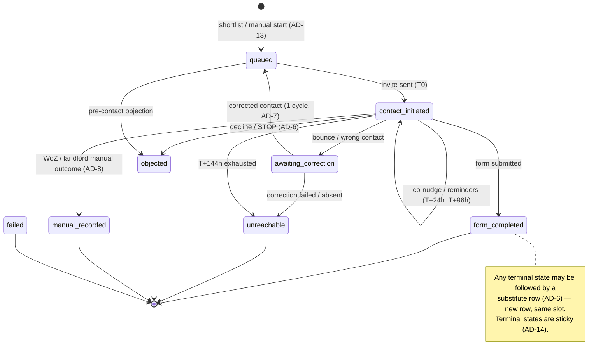

# Feature Architecture: AI Reference-Checking v1

**Addendum to the canonical [architecture.md](architecture.md)** — this document fixes only
what the reference-checking v1 build needs that the canonical architecture does not already
decide. Nothing here rewrites or supersedes the canonical document; where the two appear to
disagree, the canonical document wins and this addendum should be corrected.

**Inputs (read in full, treated as binding):**

- GitHub issue **#548** + comments, incl. the 2026-07-29 gate amendment (v1 build proceeds in
  parallel with the concierge cohort; v2 voice stays evidence-gated).
- [research/heist-535/architecture.md](research/heist-535/architecture.md) — the core input:
  `ReferenceCallResult v1` handoff schema, outcome & lifecycle semantics, retention/redaction
  policy, `acknowledgement_record` guidance.
- [research/domain-ai-voice-reference-checking-tenant-screening-research-2026-07-21.md](research/domain-ai-voice-reference-checking-tenant-screening-research-2026-07-21.md)
  — synthesis (written-first funnel, phased framework, risk register).
- [research/heist-535/legal.md](research/heist-535/legal.md) — legal flags designed in (§9 below).
- Code recon of this repo on 2026-07-29 (read-only): `supabase/migrations/`,
  `server/src/application/`, `server/src/ai/`, `server/src/notification/`,
  `server/src/retention/`, `server/src/middleware.gleam`, `server/src/router.gleam`.

## 0. Scope (decided upstream — not re-litigated here)

**v1 lands entirely in this repo. No voice, no Twilio telephony, no RightTenantryAgents
changes.**

1. Reference-details capture + `reference_contact_attestation` (acknowledgement, never
   "consent") — §3, §4.
2. Written-first referee collection: email + SMS invite → structured referee web form →
   reminders → applicant co-nudge → landlord warm handoff → `unreachable` — §5.
3. `reference_call` table + full status lifecycle — §4.
4. Data/API surface for landlord display (screens are the parallel UX workstream's job) — §8.
5. `ReferenceCallResult v1` storage with `channel: "form"` — §6.

Voice-only fields are documented as **v2-reserved** (§6.3); the additive v5
`reference_call_results[]` re-score field is the **forward contract, design-only** (§10).

---

## 1. Verified current state (what v1 builds on)

Everything below was re-verified against this repo on 2026-07-29, not assumed from research.

| Asset | Where | Relevance |
|---|---|---|
| Reference trios on `application`: `landlord_ref_name/phone/email`, `employer_ref_*` | `00000000000001_initial_schema.sql:75-80` | Capture exists; v1 designs the gaps only (§3) |
| `character_ref_*` trio (swapped in when `never_rented_before`) | `20260420000001` | Landlord-ref slot has two flavours; lifecycle treats them as one slot |
| `application_co_applicant.employer_ref_*` per employed adult | `20260420000001` | `owner_label` in the schema maps here; v1 triggering defers these (§5.6) |
| `acknowledgement_record(application_id SET NULL, record_type, granted_at, revoked_at, policy_version NOT NULL)` + `UNIQUE(application_id, record_type)` (from `20260402233721`, as `consent_type`; survived the rename) | initial schema + `20260402233721` + `20260421185540` + `20260422000001` | The attestation vehicle; the 2026-04-22 rename repudiated consent-as-basis — v1 wording must follow |
| Enum type still named `consent_type`; new values via `ALTER TYPE consent_type ADD VALUE IF NOT EXISTS` | `20260420000003` precedent | The `record_type` column's type was never renamed, only the column |
| Attestation write path at application submission (`insert_acknowledgement_records`, writes `data_processing` + `ai_analysis` unconditionally, `guarantor_attestation` conditionally on a guarantor being present) | `application_handler.gleam:1779` | v1 adds a fourth, checkbox-gated write here |
| Outbound email: Resend client (`send_email_with_headers`) | `notification/email_client.gleam` | Reused unchanged |
| **No SMS infra anywhere in the repo** | — | v1 introduces exactly one new external dependency (§7.2) |
| Public capability-token routes `/dsar/:token`, `/erase/:token` with ~288-bit path tokens, registered in **three** places: `middleware.redact_token_route` (Sentry/access-log/CSP redaction), `middleware.is_public_path`, router arm | `middleware.gleam:275,320` | The referee-form delivery pattern (§5.2). Note: this convention is token + row-lifetime only — `20260423120000` deliberately *dropped* token expiry clocks; AD-3's expiry is a new, owned decision |
| Public form flow `/apply/:code` (GET+POST, no session) | `router.gleam:776` | Proof the repo already serves anonymous multi-step forms |
| Scheduled jobs: Cloud Scheduler → **Cloud Run Job** (`main/0` via `docker-entrypoint.sh`, terraform `deployment/terraform/scheduler.tf`); the `POST /api/v1/internal/*` shared-secret routes are the **manual-fire** path, not the scheduled one | `scheduler.tf:106,188,263,344`; `digest_handler.gleam:4-6`; `verification_reminder_job.gleam:1-2` | The sweep's shape (§5.4) |
| Evidentiary IP/UA capture (`request_helpers.client_ip`, bounded 64/512) | `cookie_consent_log`, `20260523224800` | Form-session fraud signals (§7.3) |
| Retention sweep on `application.retention_due_at`; `acknowledgement_record` survives application deletion via `SET NULL` FK | `retention/`, `20260421185540` | §9.3 |
| RLS: app uses `service_role` (bypasses RLS); `rls_auto_enable` event trigger enables RLS on every new public table as defense-in-depth; **no per-table policies exist** | `20260512175704` | §4.4 — "RLS policies" here means "RLS on, no policies", per convention |
| AI client: `payload_schema_version = "v4"`, two-step session+run, additive-contract convention | `ai_client.gleam:43` | §10 forward contract |
| `reference_verification` is a first-class scoring category (weight 0.15) and `reference_validator_agent` + `check_reference_contact_duplicates` exist | RightTenantryAgents (per heist-535, verified there) | Why v2 ingestion is cheap; v1 stores data in the shape they already consume |
| Landlord notifications: `notification_type` enum extended by `ALTER TYPE ... ADD VALUE`; dispatch respects `notification_preference` | `notification_dispatch.gleam`, `20260423100001` precedent | §8.3 |
| Shortlist exists as a landlord action (`shortlist_notified_at` column + status-PATCH action) | `20260527145213`; `application_detail_handler.gleam:679` | v1 trigger hook (§5.6) |

**Gaps found vs the briefing's assumptions:** none on the trios (they exist as expected).
One correction to record: the briefing's "RLS policies" deliverable is, by repo convention,
"RLS auto-enabled, zero policies" — §4.4 says so explicitly rather than inventing policies
the codebase deliberately does not use.

---

## 2. Architecture decisions (the spine)

Each AD binds the invariant, names what it prevents, and records rationale + rejected
alternatives. `AD` IDs are stable for downstream citation.

### AD-1 — One `reference_call` row per (application, ref slot, owner); lifecycle enum is a superset [ADOPTED in part from heist-535]

**Rule:** A new `reference_call` table carries one row per referee being checked:
`(application_id, ref_slot, owner_label)` unique while non-terminal. The status enum is the
**full heist-535 lifecycle** (voice states included, marked v2-reserved) so v2 adds no enum
churn; v1 code paths only drive the v1-active subset.

**Binds:** status transitions, attempt accounting, terminal reasons.
**Prevents:** two builders inventing divergent state machines (one per channel); a v2
migration that rewrites v1 rows.

**Rationale:** the enum costs nothing now (values are inert until driven) and heist-535
already defined the semantics per outcome. Rejected: (a) a v1-only enum extended later —
every `ALTER TYPE ... ADD VALUE` is cheap, but a *renamed or reinterpreted* state is not, and
a smaller enum invites semantic drift ("`failed` means no-answer"); (b) separate
`reference_form` / `reference_call` tables — splits the lifecycle the landlord sees in half.

### AD-2 — Applicant attestation is a new `record_type` on `acknowledgement_record`

**Rule:** At application submission, a checkbox in the references form section ("my referees
know I've shared their details and expect to be contacted") writes a
`reference_contact_attestation` row to `acknowledgement_record` with the current
`policy_version`, via the existing `insert_acknowledgement_records` transaction. Wording is
acknowledgement/attestation framing — **never "consent"** (the 2026-04-22 rename repudiated
consent-as-basis; lawful basis is Art 6(1)(f)).

**Binds:** where the evidence lives, what it's called, when it's written.
**Prevents:** re-introducing the consent misreading Perkins already corrected once; a second,
parallel evidence table.

**Rationale:** exact precedent is `guarantor_attestation` (added `20260420000003`; written in
the same transaction). Rejected: (a) a separate table — duplicates a working evidence pattern,
breaks the "all transparency evidence in one place" property the rename was for; (b) folding
into `data_processing` — wrong semantic; this attestation is about *third-party* (referee)
data, not the applicant's own.

**Schema note:** the enum type is still named `consent_type` (only the column was renamed);
the migration is `ALTER TYPE consent_type ADD VALUE IF NOT EXISTS 'reference_contact_attestation'`.

**Server-side behaviour:** the checkbox is required like the other form-layer-mandatory ref
fields — submission without it fails validation (no silent skip). **Pre-v1 applications** (no
attestation row on file) still trigger reference checks on shortlist; the API exposes
`attestation_on_file: false` per application so the UX workstream can surface it and counsel
can judge the display posture (§11 Q5). Attestation is not back-filled retroactively — a row
claims the applicant ticked a box they never saw.

### AD-3 — Referee form is a new public capability-token route `/reference/:token`

**Rule:** The structured referee form lives at `GET/POST /reference/:token`, following the
`/dsar/:token` / `/erase/:token` pattern: a high-entropy token column on
`reference_call` (~288-bit, unique partial index), registered in all three places
(`redact_token_route` — so Sentry, access logs and CSP reports redact it; `is_public_path`;
router arm). The link is **resumable until
submitted** (the link works repeatedly; the form always renders fresh — there is **no draft
persistence**), accepts **one submission**, and expires when the row reaches a terminal state or
after 30 days, whichever first. The 30-day expiry is this table's **own decision**, not the
dsar/erase convention — `20260423120000` dropped expiry there because the token's row lifetime
was the source of truth; a referee form token outliving its sequence has no such natural
lifetime, so it gets an explicit clock.

**Binds:** delivery mechanism, token lifecycle, log hygiene.
**Prevents:** token leakage into telemetry (the single-source redaction registry exists
precisely so a new token route can't forget); referee accounts.

**Rationale:** the capability-token pattern is the repo's established answer to "anonymous
user must do one sensitive thing". Rejected: (a) one-time burn tokens — punishes
mobile/referee reality (link opened at work, completed at home) for no security gain at this
sensitivity; (b) referee accounts — absurd friction for a 5-minute form; (c) sending form
answers by reply email — unstructured, unverifiable, and breaks the fraud-signal capture
(§7.3).

### AD-4 — Contact cadence is data-driven from `next_attempt_at`, swept by one internal cron route

**Rule:** Per `reference_call` row, the v1 written-first sequence is:

| T | Action | Channel |
|---|---|---|
| T0 | Invite: "You've been listed as a referee — 5-minute form" + Art 14 notice link | email + SMS |
| T+24h | **Applicant co-nudge** ("nudge your referee") — the Xref mechanic, strongest industry lever | email to applicant |
| T+48h | Reminder 1 to referee | email + SMS |
| T+96h | Reminder 2 (final) to referee **and** landlord warm-handoff notification with the attempt log ("we're struggling to reach X — you may want to call them yourself") | email + SMS; landlord notification |
| T+144h | Terminal `unreachable` — **silent** (no second notification; the warm handoff already landed) | — |

The scheduled path is a **Cloud Run Job** triggered by Cloud Scheduler (new `reference-checks`
entry in `docker-entrypoint.sh` + `deployment/terraform/scheduler.tf` — the house pattern per §1),
running a 15-minute tick that processes rows where `next_attempt_at <= now()`. A shared-secret
`POST /api/v1/internal/reference-checks` route exists for **manual fires only** (the digest /
verification-reminders precedent). **The sweep owns every send, including T0:** row creation
sets `next_attempt_at = now()` and sends nothing itself. Every outbound message appends to the
row's attempt log and bumps `attempt_count`/`next_attempt_at` in one guarded update (AD-14).

**Binds:** the cadence, who is nudged when, the sweep's shape.
**Prevents:** ad-hoc "send another reminder" buttons with divergent timing; silent referee
chasing the landlord can't see.

**Rationale:** the timeline is the briefing's decided cadence; industry evidence (heist-535
fallback thread: 85–98% completion on written-first + co-nudge vs ~25–45% voice-only) backs
both the written-first order and the co-nudge's early placement. Rejected: (a) per-message
scheduled jobs (one scheduler row per message) — the `next_attempt_at` column sweep is the
existing house pattern and self-heals after downtime; (b) waiting until T+48h for the
co-nudge — the applicant's nudge is most effective while the invite is fresh.

### AD-5 — SMS is one new minimal client; email reuses Resend; ComReg Sender-ID is a launch dependency

**Rule:** v1 adds `server/src/notification/sms_client.gleam` — a minimal Twilio REST helper
(send + delivery-status), the **only new external dependency**. Email reuses
`notification/email_client.gleam` unchanged. ComReg SMS Sender-ID registration is recorded as
a **hard launch dependency** (unregistered Sender IDs arrive labelled "Likely Scam" since
2025-07-03) — flagged, not resolved here (Open question Q1).

**Binds:** provider surface area, where SMS code lives.
**Prevents:** SMS logic scattered through handlers; a premature multi-provider abstraction.

**Rationale:** one provider, one file, mirrors `email_client.gleam`. Rejected: (a) an SMS
abstraction layer for provider-swapping — YAGNI at one provider; (b) email-only v1 — the
briefing mandates the SMS leg and the completion evidence (pre-notification lift, ComReg
regime) says SMS matters; (c) reusing the inbound-email Resend webhook for STOP — SMS STOP
needs a Twilio inbound webhook; see AD-6 and Q3.

### AD-6 — Objection/STOP short-circuits everything, on every channel, with Art 21 evidence

**Rule:** Any referee objection — form-level "I decline", SMS STOP (inbound webhook), or an
email reply flagged as objection — immediately: sets outcome `objected`, cancels all pending
messages (`next_attempt_at = NULL`), blocks any future message to that contact for this row,
and **at objection time** writes a `reference_objection_log` row (reference_call_id,
application_id, objected_at, channel, payload_ref) — the Art 21 evidence, owned by the
objection handler alone and independent of the `reference_call` row's CASCADE fate (§9.2).
Terminal states are sticky: a later bounce or sweep tick cannot move an `objected` row
(AD-14). The landlord sees the true state — "referee declined contact" — never a
silent gap. The applicant may substitute a different referee: a new `reference_call` row for
the slot (prior row retained as history).

**Binds:** the short-circuit semantics, the evidence trail, the substitution path.
**Prevents:** "just one more reminder" bugs that become GDPR Art 21 violations; refusal being
rendered as (or scored as) a negative signal about the applicant.

**Rationale:** heist-535 defines this as a first-class transition, not a side effect; the
legal thread makes the right to object part of the mandatory Art 14 notice, so the honouring
mechanism must exist from day one. Rejected: (a) per-channel suppression only — an objecting
referee who still gets an SMS because they objected by email is exactly the failure mode the
rule exists to prevent; (b) deleting the row on objection — destroys the evidence the DPC
would ask for.

### AD-7 — Wrong/invalid contact triggers one applicant-correction cycle, never a re-send

**Rule:** A bounce, an SMS delivery failure, or a referee-side "wrong person" response moves
the row to `awaiting_correction` and emails the **applicant** a tokenized correction link
(same capability-token pattern, separate `correction_token` column). The corrected
address/number is stored in the row's `corrected_email`/`corrected_phone` columns — the
original `contact_*` snapshot stays immutable (§4.1) — and the sequence restarts at T0 against
the **effective contact** (corrected value when present). **One** correction cycle; a second
failure converts to `unreachable`. The discrepancy is logged as a fraud-lens signal
(`referee_contact_invalid`, see §6.4), visible to the landlord as a claim-integrity data point —
never as score content.

**Binds:** the correction path, the retry discipline, the signal's destination.
**Prevents:** repeated contact to an address/number whose real owner never received the
Art 14 notice (GDPR fairness + nuisance — heist-535's redial prohibition applied to the
written channel); silent fraud.

**Rationale:** mirrors the voice-channel rule from heist-535 ("never redial a wrong number")
in the written medium. Rejected: (a) unlimited corrections — invites coach-and-retry loops;
(b) landlord-side correction — the applicant owns the referee relationship and the landlord
chasing data-entry is the manual status quo this feature replaces.

### AD-8 — Wizard-of-Oz is in v1: `channel: "manual"` + a minimal internal recording affordance

**Rule:** The `ReferenceCallResult.channel` enum gains a third value, `"manual"` (heist-535
had `"voice" | "form"` — recorded in the §6.4 amendments register). A minimal **internal**
affordance — shared-secret ops route, same
pattern as the other internal routes — lets the founder record a manual outcome after a phone call:
outcome, the `verification` block fields, free-text summary, and notable quotes, entered by
hand. Recording on a **live** row closes it: `status → 'manual_recorded'` (a v1-active
terminal, §4.1), `outcome = 'manual_recorded'`, `next_attempt_at = NULL`, and the structured
`result` is written with `channel: "manual"`. The same affordance records landlord-reported
manual contact (the warm-handoff's "I called them myself" loop-back).

**Binds:** how founder-placed calls land in the same data shape as automated ones.
**Prevents:** two truths (a spreadsheet of founder calls vs the system of record); corrupted
funnel metrics.

**Rationale:** the 2026-07-29 gate amendment makes v1 double as the Wizard-of-Oz delivery
vehicle for the cohort pitch tests — without this, the interim test's data lives outside the
product it validates. Rejected: (a) recording manual calls as `channel: "form"` — corrupts
completion metrics and the fraud-signal baseline (a manual row has no `form_session`); (b) no
WoZ affordance in v1 — contradicts the gate amendment's stated intent.

### AD-9 — `ReferenceCallResult v1` is stored as JSONB with `schema_version` embedded; voice fields are v2-reserved

**Rule:** The full handoff schema (heist-535/architecture.md, verbatim field names) is stored
on `reference_call.result` (JSONB) with `schema_version: "refcall-v1"` inside the JSON. v1
emits `channel: "form"` or `"manual"`. Voice-only fields — `transcript`, recording URLs, AMD
outcomes, voice-channel fraud signals — are **v2-reserved**: documented, absent/null in v1,
never invented. The `form_session` fraud block is fully in scope. Structuring is deterministic
server-side code in v1 (form answers map directly onto the `verification` block); no LLM
structuring pass exists in v1.

**Binds:** the storage shape, the v1/v2 field boundary, who structures the result.
**Prevents:** v1 code emitting placeholder transcript fields that v2 then has to interpret;
a second result envelope ("form answers live over here").

**Rationale:** storing the exact v1 schema now means the v2 re-score contract (§10) reads
today's rows without a backfill. Rejected: (a) a v1-specific slimmer shape — the schema was
designed additive; subsetting it is what the null/absent semantics are for; (b) an LLM
summarisation pass for `ai_summary` in v1 — the form's structured answers make the summary
trivially templatable; an LLM adds cost, latency and a failure mode for zero accuracy gain on
structured input. (The `ai_summary.headline/summary` in v1 are deterministic renderings of
the verification block; `confidence` derives from answer completeness.)

### AD-10 — Fraud v1 is honestly scoped to what's collectible today

**Rule:** v1 populates, per `fraud_signals`:

| Signal | v1 mechanism | Collectible today? |
|---|---|---|
| `contact_reused_within_application` | Pure DB: same phone/email in two ref slots of one application | Yes |
| `contact_duplicate_of_applicant` | Pure DB: referee contact == applicant's own | Yes |
| `contact_reused_across_applications` | Pure DB: same contact under different referee names | Yes |
| `line_type` / `voip_or_burner` | Twilio Lookup Line-Type at capture | Yes — shared Twilio dependency with SMS (AD-5) |
| `form_session.completion_seconds` | Server timestamps (`form_opened_at` on first GET → `submitted_at`) + client-reported focus time | Yes |
| `form_session.ip_matches_applicant` | Referee form IP vs applicant-submission IP. **Requires new capture:** `application.submitted_ip_text` (bounded 64) written at submission — added to v1 scope by this AD (cookie-consent evidentiary precedent; internal-only; Art 13/privacy-policy update added to the counsel pack, §11 Q5) | Yes — with the new capture column |
| `form_session.device_fingerprint_match` | Referee UA vs `application.submitted_user_agent` (bounded 512, same new capture) — **not** a JS fingerprinting library | Yes, honestly weak — labelled as such |
| `form_session.geo_vs_claimed_property` | — | **No** (no geo-IP database) → emits `"unknown"` |
| `coached_answer_score` | — | **No** (no LLM pass in v1) → null |
| `voice_matches_other_reference` | — | **Reserved** (Art 9 biometric gate; v3) |

Never auto-reject on fraud signals; "not verified" ≠ "fraudulent" (heist-535 mandate);
signals are display + confidence content, not decision content (§9.4).

**Binds:** which signals exist at launch and their honesty labels.
**Prevents:** shipping a "fraud panel" full of fabricated `unknown`s presented as real
detections; scope-creep into fingerprinting libraries and geo-IP vendors for v1.

**Rationale:** the form is the completion engine, so it gets the same fraud scrutiny as voice
(Xref/Refapp parity principle from heist-535) — but only the scrutiny current infra can
actually deliver, plus the one cheap capture gap this AD explicitly adds (applicant-submission
IP/UA: two bounded columns, no new vendor, no new processing purpose beyond the screening the
applicant's Art 13 notice already covers — wording confirmed in the counsel pack).
Rejected: (a) deferring all fraud to v2 — the pure-DB signals are the
highest-value ones and cost a join; (b) buying a geo-IP/fingerprint stack for v1 — new vendor,
new DPIA surface, weak marginal signal; (c) claiming the IP-match signal without adding the
capture — the comparator does not exist anywhere in today's schema (gate-review correction).

### AD-11 — Landlord display is a data-contract extension, not a screen spec

**Rule:** `GET /api/v1/vacancies/:vid/applications/:aid` (the detail payload) gains a
`reference_calls[]` array; each entry carries: `ref_slot`, `owner_label`, `status`,
`outcome`, `attempt_count`, `next_attempt_at`, the attempt log (channel, at, outcome —
rendered for the warm handoff), the stored `result` (verification block, `ai_summary`,
`fraud_signals` — minus internal-only fields), and **manual-fallback hooks** (`can_record_manual`,
`can_substitute_referee`, `can_retry` booleans the API computes so the UX workstream renders
affordances without re-deriving state rules). Screen design is explicitly the UX workstream's
job; this document fixes only the shape they consume.

**Binds:** the API shape and the capability flags.
**Prevents:** the UX workstream inventing client-side state machines that disagree with AD-1;
leaking internal fields (tokens, raw IPs) to the landlord payload.

**Hook semantics:** `can_substitute_referee` is a landlord-side *trigger for an applicant-side
action* — clicking it emails the applicant the tokenized substitution link (§5.7); the
landlord never edits referee contact data directly (AD-7's rejected landlord-correction
alternative stands). The payload also carries `attestation_on_file` per application (AD-2's
pre-v1-application rule).

**Rationale:** the detail handler is where analysis already surfaces
(`application_detail_handler.gleam`); the parallel UX workstream needs a stable contract now.
Rejected: (a) a separate `/reference-checks` endpoint per application — the detail payload is
the established aggregate; splitting forces two fetches per screen; (b) shipping the raw
`result` JSONB verbatim — internal-only fields (§4.2) are stripped at the boundary.

### AD-12 — v5 re-score field is the forward contract (design-only)

**Rule:** The additive v5 `ScoringRequest` field `reference_call_results[]` is documented
(§10) as the forward contract per heist-535's recommended placement (a) — re-score with call
evidence on terminal outcomes. **Implementation is deferred to v2.** v1 builds nothing
against it; v1's job is to store data in exactly the shape that contract consumes.

**Binds:** the future integration point, and that v1 does NOT build it.
**Prevents:** a v1 scope explosion into the agents repo; a v2 contract that can't read v1 rows.

**Rationale:** the repo's additive-contract convention (v3→v4 added response fields; v5 adds
a request field) is the established pattern; the briefing fixes the deferral. Rejected:
(a) implementing re-score in v1 — contradicts the scope split (no RightTenantryAgents
changes); (b) display-only-forever — heist-535 already judged this weaker; the score should
eventually move on the strongest reference signal the product has.

### AD-13 — Trigger: shortlist auto-creates rows for the primary applicant's refs; co-applicant refs deferred within build

**Rule:** When a landlord shortlists an application (existing action), `reference_call` rows
are auto-created (`queued`) for the primary applicant's landlord-ref slot (or character-ref
when `never_rented_before`) and employer-ref slot. The data contract also exposes a manual
"start checks" hook for non-shortlisted applications. Co-applicant employer refs are
supported by the schema (`owner_label`) but their auto-triggering is deferred to a later
build iteration — contact volume and referee confusion both double otherwise.

**Binds:** when chasing starts and for whom.
**Prevents:** chasing referees for every applicant (cost + referee fatigue + Art 14 surface
for applicants the landlord will never pursue); an unbounded v1 contact graph.

**Rationale:** heist-535's recommended flow is "initial score → shortlist → trigger" — the
landlord has signalled intent, so the Art 6(1)(f) necessity limb is strongest and the
landlord sees chasing start exactly when they'd start chasing manually. Rejected: (a) trigger
on submission — the necessity/balancing argument weakens (processing referee data for
applicants never shortlisted) and cost scales with spam applications; (b) landlord-clicks-per-
referee only — friction the feature exists to remove.

### AD-14 — Mutation ownership: guarded updates, sticky terminals, atomic appends, sweep-owned sends

**Rule:** A `reference_call` row has seven writers (shortlist trigger, sweep, form POST,
bounce webhook, SMS webhook, correction route, record-manual route). All transitions obey:

1. **Guarded updates** — every status transition is a single `UPDATE ... WHERE id=$1 AND
   status=<expected-pre-state>` (the `claim_shortlist_notification.sql` precedent:
   conditional UPDATE + RETURNING); a 0-row result means someone else transitioned first and
   the writer stands down. No read-modify-write of status from a stale read.
2. **Terminal states are sticky** — once `form_completed`/`unreachable`/`objected`/
   `manual_recorded`/`failed` (or the v2 terminals), no writer moves the row. Objection beats
   everything: a bounce arriving after STOP leaves `objected` untouched.
3. **Atomic attempt appends** — `attempts = attempts || $1::jsonb` in the same guarded UPDATE,
   never read-append-write from the application layer.
4. **The sweep owns every send** — creation sets `next_attempt_at = now()` and sends nothing;
   no other writer sends a sequence message (webhooks/routes only transition state and write
   evidence). No duplicate T0 invites is a hard requirement (nuisance + fairness).

**Binds:** who may mutate the row, and how races resolve.
**Prevents:** the sweep overwriting a just-submitted form back to `contact_initiated`; a
bounce flipping an `objected` row into `awaiting_correction` (a fresh message to a referee
who exercised Art 21 — exactly the DPC failure AD-6 exists to prevent); lost attempt-log
entries corrupting the warm-handoff's compliance-relevant log.

### AD-15 — Security envelope for the new surface: verified webhooks, `/apply`-class abuse posture, observable sweep

**Rule:** (a) Every new webhook verifies its provider signature — Twilio `X-Twilio-Signature`
for `webhooks/twilio-sms`, Resend/svix for `webhooks/resend-events` (the existing
`inbound_email/svix.gleam` verifier is the pattern; the Stripe/Resend-inbound routes already
verify). An unauthenticated webhook is a state-mutation path guarded by nothing — forbidden.
(b) The public `/reference/*` POSTs get the `/apply`-class abuse posture: token-gated by
construction, plus timing validation (sub-fast submissions rejected) and a honeypot field;
whether Cloudflare rate rules extend to the new paths is a deploy-time checklist item, not a
code decision. (c) The sweep must fail loudly: Sentry capture on job failure and on any
webhook verification failure, and a per-tick completion log — a silently dead 15-minute cron
means no reminders, no terminals, no warm handoffs; the feature failing invisibly is not
acceptable (canonical posture is Sentry-from-day-one; this extends it).

**Binds:** authentication of every new mutation path; the abuse floor for anonymous POSTs;
liveness of the machinery.
**Prevents:** anyone POSTing a STOP to object any row; bot-submitted referee forms; silent
feature death.

### AD-16 — Lifecycle events write `audit_log` entries

**Rule:** Per the canonical audit-on-status-change convention, these events write
`audit_log` rows (entity_type `reference_call`): created (trigger), terminal transitions
(with outcome), `objected` (with channel), substitution (old + new row ids), manual record,
correction requested/applied. The attempt log on the row is operational; the audit rows are
the compliance trail.

**Binds:** what lands in the audit trail.
**Prevents:** landlord-visible, compliance-weighted state changes that exist nowhere in the
audit record the DPC would ask for.

---

## 3. Capture & attestation design (scope item 1)

### 3.1 Reference details — what exists, what's added

The trios exist (§1). v1's capture-layer gaps, designed against the current schema:

- **Nothing new on `application` or `application_co_applicant` for the trios themselves.**
- **Attestation checkbox** in the references section of the application form (client + form
  copy): the applicant attests their referees expect contact. Server-side, the submission
  transaction (`insert_acknowledgement_records`) gains the fourth write (AD-2). Form-layer
  required (the trios are already form-layer-mandatory; DB stays nullable per convention).
- **Referee contact language note:** v1 messages are English (heist-535: localized forms are
  v2). No schema change; recorded as a copy constant.

### 3.2 Attestation wording constraint

All user-facing and internal names use **attestation/acknowledgement** vocabulary. The enum
value, the copy, and any PR discussion must not say "consent" — lawful basis is Art 6(1)(f)
legitimate interest; the row evidences transparency, not a legal basis. (Perkins r1 on #540
already corrected this once; the 2026-04-22 rename exists to keep it corrected.)

---

## 4. `reference_call` table (scope item 3)

### 4.1 Shape

```sql
-- New enum: full lifecycle per heist-535; v1 drives only the v1-active subset.
CREATE TYPE reference_call_status AS ENUM (
  'queued',              -- created, not yet contacted            [v1]
  'contact_initiated',   -- invite sent, awaiting form            [v1]
  'awaiting_correction', -- bad contact; applicant correcting     [v1]
  'scheduled',           -- referee booked a call                 [v2-reserved]
  'calling',             -- voice attempt in flight               [v2-reserved]
  'completed',           -- voice call completed                  [v2-reserved]
  'partial',             -- mid-call hang-up, partial structure   [v2-reserved]
  'form_completed',      -- structured form submitted             [v1, terminal]
  'unreachable',         -- sequence exhausted                    [v1, terminal]
  'refused',             -- referee declined (non-objection)      [v2-reserved, terminal]
  'objected',            -- Art 21 objection / STOP               [v1, terminal]
  'manual_recorded',     -- WoZ/landlord manual outcome recorded  [v1, terminal]
  'failed'               -- system failure, no referee contact    [v1, terminal]
);

CREATE TYPE reference_call_outcome AS ENUM (
  -- ReferenceCallResult outcome values (heist-535) + three v1 amendments (§6.4).
  -- v1 emits: form_completed, unreachable, objected, manual_recorded
  -- (and leaves outcome NULL for status 'failed' — system failure, no referee contact).
  'completed', 'partial', 'voicemail', 'no_answer', 'busy',
  'refused', 'wrong_number', 'invalid_number', 'declined_ai',
  'language_barrier', 'gatekeeper_blocked', 'objected',
  'unreachable', 'form_completed', 'manual_recorded'
);

CREATE TABLE reference_call (
  id              UUID PRIMARY KEY DEFAULT gen_random_uuid(),
  application_id  UUID NOT NULL REFERENCES application(id) ON DELETE CASCADE,
  ref_slot        TEXT NOT NULL
                  CHECK (ref_slot IN ('landlord_ref', 'character_ref', 'employer_ref')),
  owner_label     TEXT NOT NULL DEFAULT 'primary'
                  CHECK (owner_label IN ('primary','co_applicant_0','co_applicant_1','co_applicant_2')),

  status          reference_call_status NOT NULL DEFAULT 'queued',
  outcome         reference_call_outcome,              -- set at terminal (and mid-flight for voice later)
  terminal_reason TEXT,                                -- short machine slug, e.g. 'sequence_exhausted', 'stop_received', 'correction_failed'

  -- Contact snapshot (immutable copy of the trio at creation; survives
  -- later EDITS of the application row — note the row itself dies with the
  -- application via CASCADE, so "survives erasure" is not its job)
  contact_name    TEXT NOT NULL,
  contact_email   TEXT,
  contact_phone   TEXT,
  -- Applicant-correction loop (AD-7): the corrected contact lives here;
  -- the snapshot above is NEVER overwritten. Sends and fraud joins use the
  -- EFFECTIVE contact (corrected value when present, else snapshot).
  corrected_email TEXT,
  corrected_phone TEXT,

  -- Attempt accounting (AD-4)
  attempt_count   INT NOT NULL DEFAULT 0,
  next_attempt_at TIMESTAMPTZ,                         -- set to now() at creation; sweep owns ALL sends (AD-14)
  attempts        JSONB NOT NULL DEFAULT '[]',         -- [{at, channel, outcome, detail}] append-only, atomic || (AD-14)
  correction_cycles INT NOT NULL DEFAULT 0,            -- AD-7: max 1

  -- Capability tokens (AD-3, AD-7)
  form_token        TEXT,                              -- referee form link
  form_token_expires_at TIMESTAMPTZ,                   -- 30-day clock: this table's own decision (20260423120000 dropped it for dsar/erase)
  correction_token  TEXT,                              -- applicant correction link
  form_opened_at    TIMESTAMPTZ,                       -- first GET of the form; completion_seconds input (AD-10)
  submitted_at      TIMESTAMPTZ,

  -- The handoff payload (AD-9)
  channel         TEXT CHECK (channel IN ('form','manual','voice')),
  result          JSONB,                               -- ReferenceCallResult v1, schema_version embedded
  fraud_signals   JSONB,                               -- denormalised copy of result.fraud_signals for querying

  -- Objection evidence (AD-6)
  objected_at     TIMESTAMPTZ,
  objection_detail JSONB,                              -- {channel, received_at, payload_ref}

  -- Retention (AD-9.3)
  retention_class TEXT NOT NULL DEFAULT 'referee_submission',
  purge_after     TIMESTAMPTZ,                         -- stamped at terminal: follows the application's retention schedule

  created_at      TIMESTAMPTZ NOT NULL DEFAULT now(),
  updated_at      TIMESTAMPTZ NOT NULL DEFAULT now()
);

-- One live row per (application, slot, owner): a substituted referee creates a
-- new row only after the prior row is terminal.
CREATE UNIQUE INDEX idx_reference_call_live
  ON reference_call(application_id, ref_slot, owner_label)
  WHERE status NOT IN ('form_completed','unreachable','refused','objected','manual_recorded','failed','completed','partial');

CREATE UNIQUE INDEX idx_reference_call_form_token
  ON reference_call(form_token) WHERE form_token IS NOT NULL;
CREATE UNIQUE INDEX idx_reference_call_correction_token
  ON reference_call(correction_token) WHERE correction_token IS NOT NULL;
CREATE INDEX idx_reference_call_sweep
  ON reference_call(next_attempt_at) WHERE next_attempt_at IS NOT NULL;
CREATE INDEX idx_reference_call_application
  ON reference_call(application_id);
CREATE INDEX idx_reference_call_contact_phone
  ON reference_call(contact_phone);   -- cross-application reuse fraud check
CREATE INDEX idx_reference_call_purge
  ON reference_call(purge_after) WHERE purge_after IS NOT NULL;

-- Art 21 objection evidence (AD-6): written AT OBJECTION TIME by the objection
-- handler — its only writer. Deliberately NOT CASCADE-coupled to application
-- erasure: the DPC can ask for the objection trail after the application is gone.
CREATE TABLE reference_objection_log (
  id                UUID PRIMARY KEY DEFAULT gen_random_uuid(),
  reference_call_id UUID,                              -- plain UUID, no FK: must survive both parent deletions
  application_id    UUID,                              -- same
  ref_slot          TEXT NOT NULL,
  objected_at       TIMESTAMPTZ NOT NULL,
  channel           TEXT NOT NULL,                     -- form | sms | email
  payload_ref       TEXT,                              -- pointer to raw evidence (internal-only)
  retention_class   TEXT NOT NULL DEFAULT 'objection_evidence',
  purge_after       TIMESTAMPTZ,
  created_at        TIMESTAMPTZ NOT NULL DEFAULT now()
);
CREATE INDEX idx_reference_objection_log_purge
  ON reference_objection_log(purge_after) WHERE purge_after IS NOT NULL;
```

**Type-system note (acknowledged deviation):** `ref_slot`, `owner_label`, `channel`,
`retention_class` are TEXT+CHECK, not PG enums — an owned deviation from the canonical
"ENUMs for status fields" rule: these fields mirror values inside the cross-repo JSON
contract (§6), and TEXT+CHECK keeps the DDL in lockstep with the contract without a second
enum-migration path. True state fields (`status`, `outcome`) are PG enums as canonical
requires.

**Column notes:**

- `contact_*` is a deliberate snapshot: the trio on `application` can be edited (correction
  loop); the reference_call row is the record of *who was actually contacted*. Corrections
  land in `corrected_email`/`corrected_phone`; the snapshot is never overwritten (AD-7).
- `attempts` JSONB mirrors the schema's `attempts[]` (channel `email|sms|form|voice`,
  outcome, `detail` for bounce/delivery codes). Append-only, via guarded atomic updates
  (AD-14); written by the sweep.
- `form_token` is high-entropy (~288-bit) with a unique partial index per the dsar/erase
  convention; the 30-day expiry is this table's own addition (rationale in AD-3). Tokens are
  **internal-only** (§4.2).
- `result` is null until a result exists (form submission, manual record, or terminal-no-content
  outcome — terminal-no-content rows still get a `result` with the outcome + attempts and
  null `verification`, per heist-535's "entry for EVERY terminal outcome" rule, so v2 re-score
  reads them uniformly).
- `fraud_signals` is denormalised from `result.fraud_signals` purely so fraud review can query
  without JSONB path digging; the JSONB copy is authoritative.
- Enum naming follows the repo's snake_case type convention (`application_status`,
  `notification_type`).

### 4.2 Internal-only fields

`form_token`, `correction_token`, `objection_detail.payload_ref`, raw IPs/UAs (inside
`fraud_signals.form_session`) never leave the server: the landlord API (AD-11) strips them,
and they are redacted from logs per the `redact_token_route` registry.

### 4.3 Migration shape (conventions followed)

One migration `YYYYMMDDHHMMSS_create_reference_call.sql`: header comment stating intent (the
house style), plain `CREATE TYPE` / `CREATE TABLE` (no `IF NOT EXISTS` on the enum — new
types), partial unique indexes as above, `updated_at` maintained by the same trigger function
pattern the repo already uses for `ai_analysis`/`vacancy`. A second tiny migration adds the
`consent_type` enum value (AD-2) — matching the `20260420000003` precedent of one
enum-addition migration. RLS needs no migration content (§4.4).

### 4.4 RLS

By repo convention the app talks via `service_role` and `rls_auto_enable` enables RLS on
every new public table as defense-in-depth (`20260512175704`). **No per-table policies are
written** — that is the codebase's deliberate posture, and this addendum does not invent a
new one for this table. ("RLS policies: none — auto-enabled, service-role-only access" is the
honest deliverable the briefing asked for.)

### 4.5 Lifecycle (v1-active transitions)



`scheduled`, `calling`, `completed`, `partial`, `refused` exist in the enum but no v1 code
path drives them (v2 voice). A substitution creates a **new** row; the slot's history is the
ordered set of rows.

### 4.6 v1 status ↔ outcome mapping (the table AD-1 owes a builder)

| Event (writer) | `status` | `outcome` | `result` written? | Landlord notification |
|---|---|---|---|---|
| Referee submits form (form POST) | `form_completed` | `form_completed` | Yes — full §6.2 profile | `reference_completed` |
| T+144h, sequence exhausted (sweep) | `unreachable` | `unreachable` | Yes — outcome + attempts, null `verification` (§10 uniform-read rule) | silent (warm handoff already sent at T+96h) |
| Correction cycle exhausted (sweep/correction timeout) | `unreachable` | `unreachable` | Yes — as above | `reference_unreachable` |
| Objection / STOP (any channel) | `objected` | `objected` | Yes — outcome + attempts, null `verification` | `reference_objected` |
| Manual outcome recorded (AD-8, ops route) | `manual_recorded` | `manual_recorded` | Yes — as entered | `reference_completed` |
| System failure, no referee contact (sweep) | `failed` | **NULL** + `terminal_reason` | No | none (ops alert via Sentry, AD-15) |

`failed` rows emit **no** `reference_call_results[]` entry in the v5 forward contract (no
referee contact occurred — nothing to say); every other terminal row emits exactly one entry,
per heist-535's "EVERY terminal outcome" rule.

---

## 5. Written-first collection flow (scope item 2)

### 5.1 Sequence

Per AD-4. The invite message carries: who is asking (landlord name + property), why, the
5-minute framing, the form link, the Art 14 privacy notice (short form + link to full), and
the decline route (AD-6). Copy is owned by the UX/copy workstream; the **required content
list** is architecture (Art 14 mandate, §9.1).

### 5.2 Form delivery (AD-3 details)

- `GET /reference/:token` → server-rendered form (SSR like the `/apply` flow; no SPA route).
  Unknown/expired/terminal token → branded page (the document-download branded-error
  precedent): "this link has expired or was already used" + contact route.
- `POST /reference/:token` → validates, structures the `ReferenceCallResult` (AD-9), computes
  `form_session` signals (AD-10), sets `form_completed`, fires the landlord notification.
- Registration checklist for the build (the three places, AD-3):
  `middleware.redact_token_route` arm, `middleware.is_public_path` arm, router arms.
- Resumable-until-submitted; one submission; 30-day expiry backstop (terminal states close
  sooner in practice — the whole sequence ends at T+144h).

### 5.3 Referee form content → `verification` block mapping

The form's question set maps 1:1 onto the schema's `verification` block (grounded in the
research's industry-standard reference questionnaire):

| Form question | Schema field |
|---|---|
| Confirm your name and your relationship to \<applicant\> | `identity_confirmed`, `relationship_to_applicant` |
| Did \<applicant\> rent \<address\> from you? From when to when? | `tenancy_confirmed`, `tenancy_period` (+`as_stated` vs application data) |
| What was the monthly rent? (confirm €X on application) | `rent_amount_confirmed` |
| How was their payment record? | `rent_payment_record` (always/mostly/often late/unknown) |
| What condition was the property left in? | `property_condition` |
| Did they give notice properly? | `notice_given_properly` |
| How was the deposit handled? | `deposit_returned` |
| Would you rent to them again? | `would_rent_again` (yes/no/hesitant/declined/n_a) |
| Anything else you'd like us to know? (free text) | `free_text_signals[]` |

Employer-slot forms swap tenancy questions for employment analogues (role, dates, salary-band
confirm, would-rehire) mapping onto the same fields (`tenancy_*` fields stay null;
`relationship_to_applicant: "employer"`). Decline link + channel-preference question
(`referee_channel_preference`) + the Art 14 notice block sit above the submit button.

### 5.4 The sweep

A `reference-checks` **Cloud Run Job** on a 15-minute Cloud Scheduler tick (new entry in
`docker-entrypoint.sh` + `deployment/terraform/scheduler.tf` — the house pattern, §1) with a
shared-secret `POST /api/v1/internal/reference-checks` HTTP route for manual fires. Each tick:
processes due rows (`next_attempt_at <= now()`), sends the due message, and applies the
transition + attempt append + next-step computation as one guarded update (AD-14). Follows
the `verification_reminder` module split: job entry (`main/0`) + logic + sql.

### 5.5 Failure signals into the loop

All webhooks verify provider signatures before touching state (AD-15).

- **Email bounce** (Resend events webhook — a new verified `webhooks/resend-events` route
  alongside the existing svix-verified inbound-email webhook) → AD-7 correction path.
- **SMS delivery failure** (Twilio status callback, `X-Twilio-Signature` verified) → AD-7.
- **SMS STOP / inbound reply** (Twilio inbound webhook, verified) → AD-6. See Q3 — this
  webhook is v1 scope, flagged for review as the one piece of inbound infra the repo doesn't
  already have an analogue for.

### 5.6 Trigger (AD-13 details)

Shortlist transition → create rows (`queued`) for the primary applicant's applicable slots
(landlord-or-character + employer, skipping slots with no contact data). Manual "start
reference checks" hook in the API contract for non-shortlisted applications. Co-applicant
employer slots: schema-ready, trigger deferred (rationale in AD-13).

### 5.7 Applicant co-nudge & substitution

Co-nudge (T+24h) is an email to the applicant naming the referee slot ("we haven't heard
from the referee you listed for your previous tenancy — a nudge from you helps"). Substitution
after `objected`/`unreachable`: the landlord clicks the `can_substitute_referee` affordance
(AD-11), which emails the **applicant** a tokenized substitution link (same capability-token
pattern); the applicant supplies a replacement trio there, and a new `reference_call` row is
created for the slot. The landlord never edits referee contact data (AD-7).

---

## 6. `ReferenceCallResult v1` storage (scope item 5)

### 6.1 Authoritative schema

The schema of record is **heist-535/architecture.md §"Proposed handoff schema"** — field
names verbatim, `schema_version: "refcall-v1"`. This addendum does not fork it; it profiles
it for v1.

### 6.2 v1 field presence profile

| Block | v1 (`channel: "form"`) | v1 (`channel: "manual"`) | v2 (voice) |
|---|---|---|---|
| identity (`reference_call_id` … `owner_label`) | always | always | always |
| `channel` | `"form"` | `"manual"` | `"voice"` |
| `outcome` + `attempts[]` | always (attempt channels: email/sms/form) | always (attempt channel: manual) | full |
| `verification` | on form completion; unanswered → null/`"unknown"` | as entered by founder | completed/partial only |
| `fraud_signals` | DB + lookup + `form_session` (AD-10) | DB signals only; `form_session: null` | + line-type pre-call; voice signals reserved |
| `ai_summary` | deterministic rendering (AD-9) | founder-written | LLM-structured |
| `compliance` | `gdpr_notice_given`, `referee_channel_preference`, recording fields `not_recorded` | notice fields; `not_recorded` | full incl. Art 50 disclosure |
| `transcript` | **absent (v2-reserved)** | **absent** | completed/partial |

### 6.3 v2-reserved register

`transcript` (whole block), `recording_url`, `stt_confidence_avg`, voice outcomes driven by
AMD/call-progress, `voice_matches_other_reference`, `coached_answer_score` (until an LLM pass
exists), `recording_consent` values other than `not_recorded`. v1 code must not emit
placeholder values for these; absence is the contract.

### 6.4 Amendments to heist-535 (explicit register)

The schema of record is heist-535; v1 amends it in exactly these places, recorded so the v2
consumer team amends their copy rather than discovering drift:

1. **`channel` gains `"manual"`** (AD-8) — WoZ/landlord-recorded outcomes.
2. **`outcome` gains `"unreachable"`, `"form_completed"`, `"manual_recorded"`** — heist-535's
   semantics table uses `unreachable` but its enum literal omits it (upstream inconsistency,
   fixed here); `form_completed`/`manual_recorded` are the v1 collection terminals.
3. **Fraud flag slug:** `referee_contact_invalid` **supersedes** heist-535's
   `referee_number_wrong` — the same claim-integrity signal, widened to cover email bounces
   as well as bad phone numbers (AD-7). v2's claim-integrity lens must match on the new slug.

---

## 7. Infra reuse & additions

### 7.1 Reused unchanged

Resend email client · `notification_dispatch` (+3 enum values, §8.3) · capability-token route
pattern · internal-cron route pattern · retention sweep pattern · `insert_acknowledgement_records`
· `application_detail_handler` aggregate · evidentiary IP/UA capture.

### 7.2 Added

| Addition | Shape | Dependency |
|---|---|---|
| `notification/sms_client.gleam` | Twilio REST: send + status callback URL | Twilio account + IE number + **ComReg Sender-ID registration (Q1)** |
| `webhooks/resend-events` route | svix-verified bounce/complaint → AD-7 | Resend (present) |
| `webhooks/twilio-sms` route | `X-Twilio-Signature`-verified inbound STOP/reply (Q3) + delivery status | Twilio |
| `reference-checks` Cloud Run Job + scheduler entry + manual-fire route | sweep (§5.4); terraform + `docker-entrypoint.sh` work | Cloud Scheduler |
| `POST /api/v1/internal/reference-checks/record-manual` | WoZ/manual outcome (AD-8) | shared secret |
| `/reference/:token` GET+POST (+ correction + substitution variants) | referee form + applicant correction/substitution | AD-3 registry updates |
| `reference_lookup` module (line-type) | Twilio Lookup at capture | Twilio |
| `application.submitted_ip_text` / `submitted_user_agent` capture | two bounded columns written at submission (AD-10) | Art 13 notice update (§11 Q5) |

### 7.3 Fraud-signal collection points (AD-10)

Line-type lookup runs at row creation (before the first message — a VoIP/burner flag is
cheaper than the SMS). DB-reuse checks run at creation and again at submission (contacts can
change via the correction loop). `form_session` timestamps: `form_opened_at` (first GET) and
`submitted_at` (POST), plus client-reported focus seconds; referee IP/UA captured server-side
at both; the applicant-side comparator is `application.submitted_ip_text` /
`submitted_user_agent`, captured at application submission (AD-10).

---

## 8. Landlord display data contract (scope item 4)

### 8.1 Payload

`GET /api/v1/vacancies/:vid/applications/:aid` gains (per AD-11):

```jsonc
"reference_calls": [
  {
    "reference_call_id": "uuid",
    "ref_slot": "landlord_ref",
    "owner_label": "primary",
    "status": "contact_initiated",
    "outcome": null,
    "attempt_count": 2,
    "next_attempt_at": "2026-08-01T09:00:00Z",
    "attempts": [{"at": "...", "channel": "email", "outcome": "delivered"}],
    "result": { /* §6.2 profile, internal-only fields stripped */ },
    "hooks": {"can_record_manual": true, "can_substitute_referee": false, "can_retry": false}
  }
]
```

### 8.2 State rules the API computes (so screens don't)

`can_record_manual`: any non-terminal status. `can_substitute_referee`: terminal `objected` /
`unreachable`. `can_retry`: `failed`. Per-reference display copy ("awaiting referee", "declined
contact", "unreachable after 3 attempts — try calling them yourself") derives from
`status`/`outcome` by the UX workstream; the enum is the single source.

### 8.3 Notifications

Three new `notification_type` enum values (the `20260423100001` precedent): `reference_completed`
(form submitted or manual recorded), `reference_unreachable` (the T+96h warm handoff with
attempt log, and the correction-exhausted terminal), `reference_objected`. Dispatch respects the landlord's `notification_preference`
(realtime/daily/off) per the existing dispatcher; warm-handoff emails include the attempt log
rendered. **No duplicate terminal notifications:** the T+96h warm handoff *is* the
unreachable-path notification — the T+144h transition is silent (§4.6).

---

## 9. Legal flags — designed in (not bolted on)

Each flag from the legal thread gets its designed-in mechanism. Not legal advice; the
counsel-review items (Annex III 5(b) memo, Art 14 + LIA pack) are called out in §11.

### 9.1 Art 14 notice vehicle (GDPR transparency at first contact)

Referee data comes from the applicant, so the notice is due **at the latest at the first
communication** (Art 14(3)(b)). Design: the T0 invite (email + SMS) *is* the notice vehicle —
it carries the short notice (controller identity = the landlord with RightTenantry as
processor, purpose + Art 6(1)(f) basis, data categories, retention, rights incl. **Art 21
objection**, source = "the rental applicant") and links the full notice; the form header
repeats it above the submit button; every reminder footer repeats the link and the objection
route. The attestation (AD-2) is the applicant-side counterpart evidence. Exact wording:
counsel pack (§11).

### 9.2 Art 21 objection logging

AD-6 is the mechanism; this section is the evidence rule: every objection writes a
`reference_objection_log` row **at objection time** (`reference_call_id`, `application_id`,
`ref_slot`, `objected_at`, `channel`, `payload_ref`) — deliberately *not* FK-coupled, so the
trail survives both the `reference_call` row's and the application's deletion. Single writer
(the objection handler), single store — no erasure-time snapshot step and no second owner.
The log carries `retention_class: 'objection_evidence'` + `purge_after` (§9.3).

### 9.3 GDPR retention vs DPC delete-after-tenancy

- Referee form submissions are third-party personal data. They persist for the life of the
  application analysis, then follow the **application's existing retention/erasure schedule**
  (`retention_due_at` sweep + DSAR flows) — `reference_call.application_id` CASCADE makes the
  sweep mechanical.
- Every row carries `retention_class` + `purge_after` so a
  per-row sweep *can* run ahead of application-level erasure when the class demands it
  (heist-535's mechanical-sweep rule). v1 classes: `referee_submission` (follow application),
  `objection_evidence` (carried by `reference_objection_log`, §9.2), `attempt_metadata`
  (purged with the row). `purge_after` is stamped at terminal from the application's current
  `retention_due_at` when set, else left NULL — the application-level CASCADE sweep is the v1
  enforcement path; a dedicated per-row sweep is deferred (§12).
- The 90-day audio rule from heist-535 is voice-only → v2-reserved; v1 records no audio.
- Special-category redaction (heist-535: redact before display/re-score) maps to v1 as: the
  free-text field is the only incidental-special-category surface; v1's deterministic
  structuring copies it verbatim into `free_text_signals` **with a display-time warning
  affordance** in the data contract (`result.verification.free_text_signals` flagged as
  unmoderated referee text), and the v2 LLM pass takes over redaction. Recorded as an honest
  v1 limitation with the v2 mechanism named (§11 Q4 — counsel to confirm the display-time
  posture is acceptable).

### 9.4 Art 22 — decision support only

v1 automates **collection and presentation**, never adjudication: no auto-reject on fraud
signals (AD-10), refusals/unreachability are neutral-absence (AD-6, §10 — a confidence
modifier, never negative content about the applicant), the landlord makes and owns every
decision, and the data contract carries no "verdict" field. This matches the platform's
existing decision-support posture and keeps the feature inside the Art 22 design constraint
the screening pipeline already observes.

---

## 10. Forward contract: v5 `reference_call_results[]` (design-only)

Per AD-12: an additive `ScoringRequest` field, one entry per **terminal** `reference_call`
row for the application, each entry being the stored `result` JSON (§6) as-is. Placement per
heist-535 recommendation (a): initial v4 score → shortlist → v1 collection → on terminal
outcomes, re-score with `reference_call_results[]`; `reference_validator_agent` upgrades from
letter-only to evidence-grounded, treating unreachable/refused strictly as confidence
modifiers and wrong/invalid contact as claim-integrity signal. No response-schema change.
**v1 builds none of this** — it only guarantees the stored rows already conform, so v2 is a
read-and-send, not a migration.

---

## 11. Open questions

1. **ComReg SMS Sender-ID registration** — lead time and owner unknown; hard launch dependency
   for the SMS leg (unregistered → "Likely Scam" since 2025-07-03). Registration should start
   immediately, in parallel with the build.
2. **Twilio account/IE number provisioning** for `sms_client` — billing owner assumed Moses;
   not a design blocker, but the build's first integration test needs it.
3. **Inbound SMS webhook scope** — AD-6/§5.5 include a verified Twilio inbound route for
   STOP/replies in v1 (small, same dependency). Alternative: launch email-only objection
   channels with SMS copy directing objections by email. Included in v1 as designed; flagged
   for review.
4. **Free-text display posture** — §9.3 shows referee free text to the landlord with an
   "unmoderated" flag in v1 (no LLM redaction until v2). Counsel to confirm incidental
   special-category risk is acceptable with that affordance; if not, v1 drops free-text
   display to landlords (stores it, shows "free text withheld pending review").
5. **Counsel pack (carried from the legal thread, plus v1 additions):** Annex III 5(b)/
   Art 6(3) classification memo; Art 14 notice + LIA wording; controller/processor map
   confirmation; **Art 13/privacy-policy update for the new applicant-submission IP/UA
   capture (AD-10)**; **display posture for `attestation_on_file: false` on pre-v1
   applications (AD-2)**. Launch-gating, not build-gating.

---

## 12. Deferred (named, with revisit conditions)

- **Voice everything** (Twilio telephony, ConversationRelay, structuring agent, retry worker,
  AMD, 90-day audio purge) → v2, RightTenantryAgents#168, still evidence-gated per the 2026-07-29
  amendment. Revisit: cohort veto cleared.
- **v5 re-score implementation** → v2 (AD-12). Revisit: v1 collecting in production.
- **Co-applicant employer-ref triggering** → later build iteration (AD-13). Revisit: v1
  completion data shows referee burden is tolerable.
- **Localized referee forms/messages** → v2 (heist-535). Revisit: first non-English referee
  friction observed.
- **Geo-IP, device-fingerprint library, coached-answer LLM score, answer-template clustering,
  landdirect folio ops loop** → fraud v2/v3 per the research's build order (AD-10). Revisit:
  v1 fraud-signal review with real data.
- **Voice-print/deepfake signals** → v3, Art 9 legal gate (heist-535). Revisit: counsel
  clearance.
- **Per-referee scheduling links ("book a call")** → v2 with voice. Revisit: v2 scoping.
- **Per-row `purge_after` sweep** → later build iteration. v1 enforcement is the
  application-level CASCADE sweep; the stamped columns + indexes make the per-row sweep
  mechanical when added (§9.3). Revisit: first retention class that must purge ahead of its
  application.

---

## 13. Build-shape summary (for the epics-and-stories step)

1. Migration: `reference_call` + `reference_objection_log` + enums + indexes (§4) · enum-add
   migration for `reference_contact_attestation` (AD-2) · `application.submitted_ip_text` /
   `submitted_user_agent` columns (AD-10).
2. Application form: attestation checkbox + write (§3) + submission-time IP/UA capture (AD-10).
3. `sms_client` + reference_lookup + verified webhooks (§7.2, AD-15) — behind config, no-op
   without keys.
4. `/reference/:token` form + correction + substitution routes + middleware registrations
   (AD-3, §5.2) with the `/apply`-class abuse posture (AD-15).
5. Sweep: `reference-checks` Cloud Run Job — terraform scheduler entry + `docker-entrypoint.sh`
   wiring + shared-secret manual-fire route (§5.4) + bounce/STOP handlers (§5.5) + Sentry
   liveness (AD-15).
6. Shortlist trigger + substitution (§5.6–5.7).
7. Detail-payload extension + notifications (§8) — shared-package types + codecs for
   `reference_calls[]` per the canonical compilation-boundary convention.
8. WoZ internal route (AD-8).
9. Retention/erasure integration + `audit_log` entries (§9.2–9.3, AD-16).
10. Tests: one test module per new server module, per canonical structure convention.

*Canonical cross-references: [architecture.md](architecture.md) (conventions, API response
format, naming), [prd.md](prd.md) (decision-support posture, journeys), research thread files
under [research/heist-535/](research/heist-535/).*
